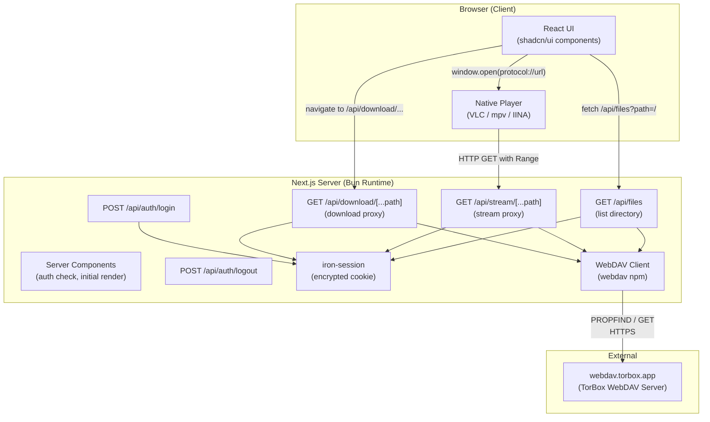

# DoMa Web — Architecture Document

> **Purpose**: This document is a complete, self-contained reference for building the DoMa web application. Any developer or AI agent should be able to read this document and build the full application without needing additional context.

---

## 1. What Is DoMa Web?

DoMa Web is a **self-hosted web application** that lets users browse, stream, and download files from their [TorBox](https://torbox.app) cloud storage account. It connects to TorBox via the **WebDAV protocol** — no API key integration or rclone installation needed.

### Core User Flow

```
User opens DoMa Web in browser
  → Logs in with TorBox credentials
  → Browses their TorBox file library (folders, files)
  → For any file, they can:
      1. Copy a streamable link to clipboard
      2. Launch the file in their native media player (VLC, mpv, IINA, etc.)
      3. Download the file to their machine
```

### Constraints

- **TorBox WebDAV is read-only** — users cannot upload, rename, or delete files through this app.
- **WebDAV refreshes every 15 minutes** — newly added torrents may not appear instantly. A manual refresh can be triggered.
- **Self-hosted** — the user runs this on their own machine or server. Credentials never leave their instance.

---

## 2. Tech Stack

Every dependency listed here is production-grade and actively maintained.

| Layer | Library | Version | Purpose |
|---|---|---|---|
| **Runtime** | [Bun](https://bun.sh) | latest | JavaScript/TypeScript runtime. Faster than Node.js for `fetch` proxying and startup. |
| **Framework** | [Next.js](https://nextjs.org) | 15 (App Router) | Full-stack React framework. Server Components for secure WebDAV access, Route Handlers for stream/download proxying. |
| **Language** | TypeScript | 5.x | Type safety across the entire codebase. |
| **UI Components** | [shadcn/ui](https://ui.shadcn.com) | latest | Production-grade React components built on Radix UI primitives. Not an npm dependency — components are copied into the project and owned by us. |
| **Styling** | [Tailwind CSS](https://tailwindcss.com) | 4.x | Required by shadcn/ui. Utility-first CSS framework. |
| **Icons** | [Lucide React](https://lucide.dev) | latest | Consistent, tree-shakeable icon set. Ships with shadcn/ui. |
| **Fonts** | [Geist](https://vercel.com/font) via `next/font` | — | Self-hosted via Next.js font optimization. No external CDN requests. Sans + Mono variants. |
| **Theming** | [next-themes](https://github.com/pacocoursey/next-themes) | latest | Dark/light mode toggle with system preference detection. |
| **Toast Notifications** | [Sonner](https://sonner.emilkowal.dev) | latest | Lightweight, accessible toast system. Used for "Link copied" feedback and error reporting. |
| **WebDAV Client** | [webdav](https://www.npmjs.com/package/webdav) | 5.x | Talks to `https://webdav.torbox.app`. Lists directories, stats files, creates read streams with Range support. |
| **Session Management** | [iron-session](https://github.com/vvo/iron-session) | 8.x | Encrypted, stateless cookie-based sessions. No database needed. Stores user credentials securely. |
| **Schema Validation** | [Zod](https://zod.dev) | 3.x | Validates login form data, API query params, and session shape. |

### Why These Choices?

- **shadcn/ui over custom components**: Provides accessible, keyboard-navigable, screen-reader-friendly components out of the box (Dialog, DropdownMenu, Select, Tooltip, etc.). Zero lock-in — we own the source.
- **Tailwind over vanilla CSS**: Required by shadcn/ui and provides consistent, maintainable styling with dark mode built in.
- **iron-session over JWT/NextAuth**: We only need to store WebDAV credentials (username + password). iron-session encrypts them into a cookie — no database, no OAuth complexity. Perfect for self-hosted.
- **webdav npm over rclone**: Eliminates the system dependency. Pure JS, works everywhere Bun/Node runs. No subprocess management.
- **Sonner over react-hot-toast**: Better accessibility, promise-based toasts, smaller bundle, integrates with shadcn/ui.

---

## 3. Architecture

### 3.1 High-Level Data Flow



### 3.2 Request Flow for Each Feature

#### Authentication

```
Browser                    Next.js Server                 TorBox WebDAV
  |                            |                              |
  |-- POST /api/auth/login --> |                              |
  |   { username, password }   |                              |
  |                            |-- getDirectoryContents("/")-->|
  |                            |   (validates credentials)     |
  |                            |<---- 200 OK / 401 ---------- |
  |                            |                              |
  |                            |-- Set encrypted cookie -----> |
  |<-- 200 + Set-Cookie -------|                              |
  |                            |                              |
  |-- Redirect to / --------->|                              |
```

#### File Listing

```
Browser                    Next.js Server                 TorBox WebDAV
  |                            |                              |
  |-- GET /api/files?path=/ -->|                              |
  |                            |-- Read session cookie         |
  |                            |-- getDirectoryContents("/")-->|
  |                            |<---- Array of FileStat ------| 
  |<-- JSON: FileItem[] -------|                              |
  |                            |                              |
  | (render file grid/list)    |                              |
```

#### Stream (Native Player)

```
Browser                    Next.js Server                 TorBox WebDAV
  |                            |                              |
  | User clicks "Stream"       |                              |
  |                            |                              |
  | window.open(               |                              |
  |   "vlc://http://           |                              |
  |    localhost:3000/          |                              |
  |    api/stream/movie.mkv")  |                              |
  |                            |                              |
  |         VLC opens and requests:                           |
  |         GET /api/stream/movie.mkv                         |
  |         Range: bytes=0-                                   |
  |                            |                              |
  |                            |-- Read session cookie         |
  |                            |-- createReadStream(           |
  |                            |     "/movie.mkv",             |
  |                            |     { range })  ------------>|
  |                            |<---- Byte stream ----------- |
  |<-- 206 Partial Content ----|                              |
  |    Content-Range: bytes    |                              |
  |    (video plays in VLC)    |                              |
```

> **Important**: When a native player (VLC, mpv) opens the stream URL, it must include the session cookie for authentication. Since native players do NOT send browser cookies, the stream route must also support an alternative auth mechanism: a **short-lived token** passed as a query parameter (e.g., `/api/stream/movie.mkv?token=abc123`). This token is generated server-side when the user clicks "Stream" and is valid for a limited time (e.g., 1 hour).

#### Download

```
Browser                    Next.js Server                 TorBox WebDAV
  |                            |                              |
  | User clicks "Download"     |                              |
  | window.open(               |                              |
  |   "/api/download/file.mkv")|                              |
  |                            |                              |
  |-- GET /api/download/...  ->|                              |
  |                            |-- Read session cookie         |
  |                            |-- createReadStream(path) --->|
  |                            |<---- Byte stream ----------- |
  |<-- 200 OK -----------------|                              |
  |    Content-Disposition:    |                              |
  |      attachment;           |                              |
  |      filename="file.mkv"  |                              |
  |    (browser download       |                              |
  |     dialog opens)          |                              |
```

#### Copy Link

```
Browser
  |
  | User clicks "Copy Link"
  |
  | 1. POST /api/auth/create-token → get short-lived token
  | 2. navigator.clipboard.writeText(
  |      "http://localhost:3000/api/stream/path/to/file.mkv?token=abc123"
  |    )
  | 3. Sonner toast: "Link copied to clipboard"
  |
  | (User can paste this URL into any app — mpv, wget, aria2, browser, etc.)
```

---

## 4. Data Models

### 4.1 Session Schema

```typescript
// Stored in an encrypted iron-session cookie (max ~4KB)
interface SessionData {
  // WebDAV credentials
  username: string;    // TorBox email OR "torbox" for API key auth
  password: string;    // TorBox password OR API key

  // User preferences (also saved to localStorage on client for fast access)
  playerProtocol: string;  // e.g., "vlc", "iina", "mpv", "potplayer", "custom"
}
```

### 4.2 File Item (API Response)

```typescript
// Returned by GET /api/files
interface FileItem {
  name: string;         // "movie.mkv"
  path: string;         // "/torrents/movie.mkv" (full WebDAV path)
  size: number;         // bytes
  sizeFormatted: string; // "4.2 GB"
  type: "file" | "directory";
  mimeType: string;     // "video/x-matroska"
  lastModified: string; // ISO 8601
  isVideo: boolean;     // derived from extension/mime
  isAudio: boolean;     // derived from extension/mime
  extension: string;    // "mkv"
}
```

### 4.3 Player Configuration

```typescript
// Predefined player protocol handlers
interface PlayerConfig {
  id: string;           // "vlc" | "iina" | "mpv" | "potplayer" | "infuse" | "custom"
  name: string;         // "VLC Media Player"
  urlTemplate: string;  // Template with {url} placeholder
  platforms: string[];  // ["windows", "macos", "linux"]
}

// Built-in player configs
const PLAYERS: PlayerConfig[] = [
  {
    id: "vlc",
    name: "VLC Media Player",
    urlTemplate: "vlc://{url}",
    platforms: ["windows", "macos", "linux"],
  },
  {
    id: "iina",
    name: "IINA",
    urlTemplate: "iina://weblink?url={url}",
    platforms: ["macos"],
  },
  {
    id: "mpv",
    name: "mpv (via mpv-handler)",
    urlTemplate: "mpv://play/{base64url}",  // base64-encoded URL
    platforms: ["windows", "macos", "linux"],
  },
  {
    id: "potplayer",
    name: "PotPlayer",
    urlTemplate: "potplayer://{url}",
    platforms: ["windows"],
  },
  {
    id: "infuse",
    name: "Infuse",
    urlTemplate: "infuse://x-callback-url/play?url={url}",
    platforms: ["macos", "ios"],
  },
  {
    id: "custom",
    name: "Custom",
    urlTemplate: "",  // User provides their own template
    platforms: ["windows", "macos", "linux"],
  },
];
```

### 4.4 Stream Token (for native player auth)

```typescript
// Short-lived token for authenticating stream requests from native players
interface StreamToken {
  token: string;        // Random UUID or crypto token
  filePath: string;     // WebDAV path the token authorizes
  username: string;     // WebDAV username
  password: string;     // WebDAV password
  expiresAt: number;    // Unix timestamp (e.g., 1 hour from creation)
}

// Stored in an in-memory Map on the server (no DB needed for self-hosted)
// Map<string, StreamToken> — key is the token string
```

---

## 5. API Routes Contract

### 5.1 `POST /api/auth/login`

**Purpose**: Validate TorBox credentials and create a session.

```typescript
// Request body
{
  username: string,  // TorBox email or "torbox"
  password: string   // TorBox password or API key
}

// Success response (200)
{ success: true }
// + Set-Cookie header with encrypted iron-session cookie

// Failure response (401)
{ success: false, error: "Invalid credentials" }
```

**Implementation logic**:
1. Parse and validate body with Zod.
2. Create a temporary `webdav` client with the provided credentials.
3. Call `client.getDirectoryContents("/")` as a connectivity test.
4. If successful → save credentials to iron-session → return 200.
5. If WebDAV returns 401/403 → return 401.

### 5.2 `POST /api/auth/logout`

**Purpose**: Destroy the session.

```typescript
// Response (200)
{ success: true }
// + Set-Cookie header clearing the session cookie
```

### 5.3 `POST /api/auth/create-token`

**Purpose**: Generate a short-lived token for stream URLs (used by native players and "Copy Link").

```typescript
// Request body
{
  filePath: string  // WebDAV path to authorize
}

// Response (200)
{
  token: string,     // e.g., "a1b2c3d4-e5f6-..."
  expiresAt: string  // ISO 8601, e.g., 1 hour from now
}
```

**Implementation logic**:
1. Read session to verify the user is authenticated.
2. Generate a random token (e.g., `crypto.randomUUID()`).
3. Store in an in-memory `Map<string, StreamToken>` with credentials + expiry.
4. Return the token.
5. A periodic cleanup removes expired tokens.

### 5.4 `GET /api/files?path=/some/folder`

**Purpose**: List contents of a WebDAV directory.

```typescript
// Query params
{
  path: string  // WebDAV path, default "/"
}

// Success response (200)
{
  items: FileItem[],
  currentPath: string,
  breadcrumbs: { name: string, path: string }[]
}

// Auth failure (401)
{ error: "Not authenticated" }
```

**Implementation logic**:
1. Read session → get credentials → create WebDAV client.
2. Call `client.getDirectoryContents(path)`.
3. Map results to `FileItem[]` — derive `isVideo`, `isAudio`, `sizeFormatted`, `extension`.
4. Build breadcrumb array from the path.
5. Return JSON.

### 5.5 `GET /api/stream/[...path]`

**Purpose**: Proxy file content from WebDAV to the requester (native player or browser). Supports HTTP Range headers for seeking.

```typescript
// URL example: /api/stream/torrents/Movie.2024/movie.mkv?token=abc123
// The [...path] catch-all captures: ["torrents", "Movie.2024", "movie.mkv"]
// Reconstruct WebDAV path: "/torrents/Movie.2024/movie.mkv"
```

**Authentication**: Accepts EITHER:
- Session cookie (for browser-initiated requests like downloads)
- `?token=abc123` query parameter (for native player requests)

**Implementation logic**:
1. Check for session cookie OR validate token from query param.
2. Get WebDAV credentials from session or token store.
3. Create WebDAV client, reconstruct the full path from URL segments.
4. Get file stats via `client.stat(path)` — need `size` for Content-Range.
5. Read the `Range` header from the incoming request.
6. If Range header present:
   - Parse `bytes=START-END`.
   - Create a read stream with `client.createReadStream(path, { range: { start, end } })`.
   - Respond with `206 Partial Content`, headers: `Content-Range`, `Content-Length`, `Accept-Ranges: bytes`, `Content-Type`.
7. If no Range header:
   - Create a full read stream.
   - Respond with `200 OK`, headers: `Content-Length`, `Accept-Ranges: bytes`, `Content-Type`.
8. **Pipe the WebDAV stream directly to the response — NEVER buffer the entire file in memory.**

### 5.6 `GET /api/download/[...path]`

**Purpose**: Same as stream, but triggers a browser download.

**Implementation**: Identical to `/api/stream/[...path]` but adds:
```
Content-Disposition: attachment; filename="original-filename.mkv"
```

---

## 6. Component Architecture

### 6.1 Component Tree

```
RootLayout (layout.tsx)
├── Geist font applied via next/font
├── ThemeProvider (next-themes)
├── Sonner <Toaster />
│
├── LoginPage (/login)
│   └── LoginForm (client component)
│       ├── shadcn: Tabs — switch between "Email + Password" / "API Key"
│       ├── shadcn: Card — form container
│       ├── shadcn: Input — credential fields
│       ├── shadcn: Button — submit
│       └── Zod validation on submit
│
├── MainLayout (/) [requires auth — server component redirects if no session]
│   ├── Sidebar (client component)
│   │   ├── DoMa logo + branding
│   │   ├── Nav items: Browse, Settings
│   │   ├── shadcn: Button, Tooltip
│   │   └── Theme toggle (dark/light)
│   │
│   ├── Header (client component)
│   │   ├── Breadcrumbs (clickable path segments)
│   │   ├── Search input (shadcn: Input)
│   │   ├── View toggle: Grid / List (shadcn: ToggleGroup)
│   │   ├── Sort dropdown (shadcn: Select) — name, size, date
│   │   └── Refresh button (re-fetches file listing)
│   │
│   └── FileBrowser (client component)
│       ├── Loading state → shadcn: Skeleton cards
│       ├── Empty state → illustration + message
│       ├── Error state → retry button
│       └── Grid or List of:
│           └── FileCard (client component)
│               ├── File type icon (Lucide icon mapped by extension)
│               ├── File name (truncated with tooltip)
│               ├── File size + last modified date
│               ├── shadcn: Badge — file type label
│               ├── **Three action buttons** (always visible):
│               │   ├── 🔗 Copy Link (shadcn: Button variant="ghost")
│               │   │   → POST /api/auth/create-token
│               │   │   → navigator.clipboard.writeText(streamURL)
│               │   │   → Sonner toast "Link copied"
│               │   │
│               │   ├── ▶ Stream (shadcn: Button variant="default")
│               │   │   → POST /api/auth/create-token
│               │   │   → buildPlayerURL(protocol, streamURL)
│               │   │   → window.open(playerURL)
│               │   │
│               │   └── ⬇ Download (shadcn: Button variant="outline")
│               │       → window.open("/api/download/" + path)
│               │       → triggers browser download dialog
│               │
│               └── Click on folder row/card → update path → re-fetch
│
└── SettingsPage (/settings)
    ├── Player Configuration section
    │   ├── Player dropdown (shadcn: Select) — VLC, IINA, mpv, PotPlayer, Infuse, Custom
    │   ├── Custom protocol input (shadcn: Input) — shown when "Custom" selected
    │   └── "Test" button → opens a test URL with selected protocol
    ├── Account Info section
    │   └── Shows connected username
    ├── Logout button (shadcn: Button variant="destructive")
    └── About section — version, links
```

### 6.2 shadcn/ui Components to Install

```bash
bunx --bun shadcn@latest add button card input tabs select tooltip toggle-group skeleton separator dropdown-menu dialog badge
```

Component usage map:
- **button** — all action buttons (Copy, Stream, Download, Login, Logout, Refresh)
- **card** — file cards, settings sections, login form container
- **input** — search, credentials, custom protocol template
- **tabs** — login method switcher (Email+Password / API Key)
- **select** — sort dropdown, player selector
- **tooltip** — hover hints on action buttons and truncated filenames
- **toggle-group** — grid/list view switcher
- **skeleton** — loading states for file cards
- **separator** — visual dividers in sidebar and settings
- **dropdown-menu** — optional context menus
- **dialog** — player setup help, confirmation dialogs
- **badge** — file type labels (Video, Audio, Archive, etc.)

---

## 7. File Structure

```
doma-web/
├── src/
│   ├── app/
│   │   ├── layout.tsx                      # Root: fonts, ThemeProvider, Toaster
│   │   ├── page.tsx                        # Main file browser (auth-gated server component)
│   │   ├── login/
│   │   │   └── page.tsx                    # Login page
│   │   ├── settings/
│   │   │   └── page.tsx                    # Settings page (player config, account, logout)
│   │   ├── api/
│   │   │   ├── auth/
│   │   │   │   ├── login/route.ts          # POST: validate creds, create session
│   │   │   │   ├── logout/route.ts         # POST: destroy session
│   │   │   │   └── create-token/route.ts   # POST: generate short-lived stream token
│   │   │   ├── files/
│   │   │   │   └── route.ts               # GET: list directory contents
│   │   │   ├── stream/
│   │   │   │   └── [...path]/route.ts     # GET: stream proxy with Range + token auth
│   │   │   └── download/
│   │   │       └── [...path]/route.ts     # GET: download proxy with Content-Disposition
│   │   └── globals.css                     # Tailwind base + shadcn/ui theme tokens
│   │
│   ├── components/
│   │   ├── ui/                             # shadcn/ui generated components
│   │   │   ├── button.tsx
│   │   │   ├── card.tsx
│   │   │   ├── input.tsx
│   │   │   ├── tabs.tsx
│   │   │   ├── select.tsx
│   │   │   ├── tooltip.tsx
│   │   │   ├── toggle-group.tsx
│   │   │   ├── skeleton.tsx
│   │   │   ├── separator.tsx
│   │   │   ├── dropdown-menu.tsx
│   │   │   ├── dialog.tsx
│   │   │   └── badge.tsx
│   │   │
│   │   ├── login-form.tsx                  # Login form with credential tabs
│   │   ├── sidebar.tsx                     # App sidebar with navigation
│   │   ├── header.tsx                      # Search, breadcrumbs, view controls
│   │   ├── breadcrumbs.tsx                 # Clickable path segments
│   │   ├── file-browser.tsx                # Main file grid/list container + data fetching
│   │   ├── file-card.tsx                   # Individual file/folder card
│   │   ├── file-icon.tsx                   # Maps file extension → Lucide icon
│   │   ├── file-actions.tsx                # Three buttons: Copy Link, Stream, Download
│   │   ├── player-selector.tsx             # Player config dropdown + custom input
│   │   └── theme-toggle.tsx                # Dark/light mode switch
│   │
│   └── lib/
│       ├── session.ts                      # iron-session config + getSession() helper
│       ├── webdav.ts                       # createWebDAVClient() + getAuthenticatedClient()
│       ├── players.ts                      # PLAYERS array + buildPlayerURL()
│       ├── tokens.ts                       # In-memory token store + create/validate/cleanup
│       ├── types.ts                        # FileItem, PlayerConfig, SessionData, etc.
│       ├── utils.ts                        # formatBytes, getMimeType, getFileType, etc.
│       └── constants.ts                    # Extension sets, default config values
│
├── public/                                 # Static assets
├── .env.example                            # Template for .env.local
├── .env.local                              # SESSION_SECRET (not committed)
├── components.json                         # shadcn/ui configuration
├── tailwind.config.ts                      # Theme customization
├── tsconfig.json
├── next.config.ts
├── package.json
├── bun.lockb
├── Dockerfile                              # Optional Docker deployment
├── .dockerignore
├── ARCHITECTURE.md                         # This file
└── README.md                               # User-facing setup instructions
```

---

## 8. Key Implementation Details

### 8.1 WebDAV Client Factory

```typescript
// src/lib/webdav.ts
import { createClient, WebDAVClient } from "webdav";
import { getSession } from "./session";

const WEBDAV_BASE_URL = process.env.WEBDAV_BASE_URL || "https://webdav.torbox.app";

export function createWebDAVClient(username: string, password: string): WebDAVClient {
  return createClient(WEBDAV_BASE_URL, {
    username,
    password,
  });
}

export async function getAuthenticatedClient(): Promise<WebDAVClient> {
  const session = await getSession();
  if (!session.username || !session.password) {
    throw new Error("Not authenticated");
  }
  return createWebDAVClient(session.username, session.password);
}
```

### 8.2 Session Configuration

```typescript
// src/lib/session.ts
import { getIronSession, SessionOptions } from "iron-session";
import { cookies } from "next/headers";

export interface SessionData {
  username: string;
  password: string;
  playerProtocol: string; // default: "vlc"
}

export const sessionOptions: SessionOptions = {
  password: process.env.SESSION_SECRET as string, // Must be 32+ characters
  cookieName: "doma-session",
  cookieOptions: {
    secure: process.env.NODE_ENV === "production",
    httpOnly: true,
    sameSite: "lax" as const,
    maxAge: 60 * 60 * 24 * 30, // 30 days
  },
};

export async function getSession() {
  const cookieStore = await cookies();
  return getIronSession<SessionData>(cookieStore, sessionOptions);
}
```

### 8.3 Token Store (In-Memory)

```typescript
// src/lib/tokens.ts
import { randomUUID } from "crypto";

interface StreamToken {
  filePath: string;
  username: string;
  password: string;
  expiresAt: number; // Unix timestamp
}

const tokenStore = new Map<string, StreamToken>();
const TOKEN_TTL_MS = 60 * 60 * 1000; // 1 hour

export function createToken(filePath: string, username: string, password: string): string {
  const token = randomUUID();
  tokenStore.set(token, {
    filePath,
    username,
    password,
    expiresAt: Date.now() + TOKEN_TTL_MS,
  });
  cleanup(); // Remove expired tokens
  return token;
}

export function validateToken(token: string, requestedPath: string): StreamToken | null {
  const entry = tokenStore.get(token);
  if (!entry) return null;
  if (Date.now() > entry.expiresAt) {
    tokenStore.delete(token);
    return null;
  }
  // Token authorizes the specific file path it was created for
  if (entry.filePath !== requestedPath) return null;
  return entry;
}

function cleanup() {
  const now = Date.now();
  for (const [key, value] of tokenStore) {
    if (now > value.expiresAt) tokenStore.delete(key);
  }
}
```

### 8.4 Stream Proxy Route (Critical Path)

```typescript
// src/app/api/stream/[...path]/route.ts
import { NextRequest, NextResponse } from "next/server";
import { getSession } from "@/lib/session";
import { createWebDAVClient } from "@/lib/webdav";
import { validateToken } from "@/lib/tokens";
import { getMimeType } from "@/lib/utils";

export async function GET(
  request: NextRequest,
  { params }: { params: Promise<{ path: string[] }> }
) {
  const { path } = await params;
  const filePath = "/" + path.map(decodeURIComponent).join("/");

  // Auth: try session cookie first, then token query param
  let username: string;
  let password: string;

  const tokenParam = request.nextUrl.searchParams.get("token");
  if (tokenParam) {
    const tokenData = validateToken(tokenParam, filePath);
    if (!tokenData) {
      return NextResponse.json({ error: "Invalid or expired token" }, { status: 401 });
    }
    username = tokenData.username;
    password = tokenData.password;
  } else {
    const session = await getSession();
    if (!session.username || !session.password) {
      return NextResponse.json({ error: "Not authenticated" }, { status: 401 });
    }
    username = session.username;
    password = session.password;
  }

  try {
    const client = createWebDAVClient(username, password);

    // Get file size for Content-Range
    const stat = await client.stat(filePath);
    const fileSize = (stat as any).size as number;
    const mimeType = getMimeType(filePath);

    // Parse Range header
    const rangeHeader = request.headers.get("range");

    if (rangeHeader) {
      const match = rangeHeader.match(/bytes=(\d+)-(\d*)/);
      const start = parseInt(match?.[1] || "0");
      const end = match?.[2] ? parseInt(match[2]) : fileSize - 1;
      const chunkSize = end - start + 1;

      const stream = client.createReadStream(filePath, {
        range: { start, end },
      });

      const webStream = nodeStreamToWeb(stream);

      return new NextResponse(webStream, {
        status: 206,
        headers: {
          "Content-Range": `bytes ${start}-${end}/${fileSize}`,
          "Accept-Ranges": "bytes",
          "Content-Length": String(chunkSize),
          "Content-Type": mimeType,
          "Cache-Control": "no-cache",
        },
      });
    }

    // Full file
    const stream = client.createReadStream(filePath);
    const webStream = nodeStreamToWeb(stream);

    return new NextResponse(webStream, {
      status: 200,
      headers: {
        "Accept-Ranges": "bytes",
        "Content-Length": String(fileSize),
        "Content-Type": mimeType,
        "Cache-Control": "no-cache",
      },
    });
  } catch (error) {
    console.error("Stream error:", error);
    return NextResponse.json({ error: "Stream failed" }, { status: 500 });
  }
}

// Helper: convert Node.js Readable to Web ReadableStream
function nodeStreamToWeb(nodeStream: any): ReadableStream {
  return new ReadableStream({
    start(controller) {
      nodeStream.on("data", (chunk: Buffer) => controller.enqueue(new Uint8Array(chunk)));
      nodeStream.on("end", () => controller.close());
      nodeStream.on("error", (err: Error) => controller.error(err));
    },
    cancel() {
      nodeStream.destroy();
    },
  });
}
```

### 8.5 Download Route

```typescript
// src/app/api/download/[...path]/route.ts
// Identical to stream route but adds Content-Disposition header.
// Extract the filename from the path and set:

headers: {
  ...streamHeaders,
  "Content-Disposition": `attachment; filename="${encodeURIComponent(filename)}"`,
}
```

### 8.6 Player URL Builder

```typescript
// src/lib/players.ts
import { PLAYERS } from "./constants";

export function buildPlayerURL(playerProtocol: string, streamURL: string): string {
  const player = PLAYERS.find((p) => p.id === playerProtocol);
  if (!player || !player.urlTemplate) return streamURL;

  // mpv-handler uses base64-encoded URL
  if (playerProtocol === "mpv") {
    const base64 = btoa(streamURL);
    return player.urlTemplate.replace("{base64url}", base64);
  }

  // Most players: encode the full stream URL
  const encoded = encodeURIComponent(streamURL);
  return player.urlTemplate.replace("{url}", encoded);
}
```

### 8.7 File Type Detection & Utilities

```typescript
// src/lib/utils.ts

const VIDEO_EXTENSIONS = new Set([
  "mp4", "mkv", "avi", "mov", "wmv", "flv", "webm", "m4v",
  "mpg", "mpeg", "ts", "m2ts", "vob", "3gp", "ogv",
]);

const AUDIO_EXTENSIONS = new Set([
  "mp3", "flac", "aac", "ogg", "wav", "wma", "m4a", "opus", "alac",
]);

const ARCHIVE_EXTENSIONS = new Set([
  "zip", "rar", "7z", "tar", "gz", "bz2", "xz",
]);

const SUBTITLE_EXTENSIONS = new Set([
  "srt", "sub", "ass", "ssa", "vtt",
]);

export function getFileType(filename: string): "video" | "audio" | "archive" | "subtitle" | "image" | "document" | "other" {
  const ext = filename.split(".").pop()?.toLowerCase() || "";
  if (VIDEO_EXTENSIONS.has(ext)) return "video";
  if (AUDIO_EXTENSIONS.has(ext)) return "audio";
  if (ARCHIVE_EXTENSIONS.has(ext)) return "archive";
  if (SUBTITLE_EXTENSIONS.has(ext)) return "subtitle";
  return "other";
}

export function getMimeType(filename: string): string {
  const ext = filename.split(".").pop()?.toLowerCase() || "";
  const mimeMap: Record<string, string> = {
    mp4: "video/mp4", mkv: "video/x-matroska", avi: "video/x-msvideo",
    mov: "video/quicktime", webm: "video/webm", ts: "video/mp2t",
    flv: "video/x-flv", wmv: "video/x-ms-wmv", m4v: "video/x-m4v",
    mp3: "audio/mpeg", flac: "audio/flac", aac: "audio/aac",
    ogg: "audio/ogg", wav: "audio/wav", m4a: "audio/mp4",
    opus: "audio/opus", zip: "application/zip", rar: "application/x-rar",
    srt: "text/plain", vtt: "text/vtt",
  };
  return mimeMap[ext] || "application/octet-stream";
}

export function formatBytes(bytes: number): string {
  if (bytes === 0) return "0 B";
  const k = 1024;
  const sizes = ["B", "KB", "MB", "GB", "TB"];
  const i = Math.floor(Math.log(bytes) / Math.log(k));
  return parseFloat((bytes / Math.pow(k, i)).toFixed(1)) + " " + sizes[i];
}
```

---

## 9. Theming & Design

### 9.1 Design Principles

1. **Dark mode default** — optimized for media browsing (easy on the eyes).
2. **Glassmorphism cards** — subtle backdrop blur and transparency on file cards.
3. **Micro-animations** — hover scale on cards, button press feedback, skeleton loading pulse.
4. **Responsive** — works on desktop, tablet, and mobile widths.
5. **Premium feel** — no generic colors. Use curated HSL palette via shadcn/ui theming.

### 9.2 Color Palette (Dark Mode — Primary)

Applied via shadcn/ui CSS variables in `globals.css`:

```css
.dark {
  --background: 240 10% 3.9%;         /* Near-black background */
  --foreground: 0 0% 95%;             /* Off-white text */
  --card: 240 6% 10%;                 /* Dark card surface */
  --card-foreground: 0 0% 95%;
  --primary: 250 84% 54%;             /* Vibrant purple accent */
  --primary-foreground: 0 0% 98%;
  --secondary: 240 5% 16%;
  --muted: 240 4% 16%;
  --muted-foreground: 240 5% 64.9%;
  --accent: 250 84% 54%;
  --accent-foreground: 0 0% 98%;
  --border: 240 4% 16%;
  --ring: 250 84% 54%;
}
```

### 9.3 Font Setup

```typescript
// layout.tsx
import { Geist, Geist_Mono } from "next/font/google";

const geistSans = Geist({ variable: "--font-geist-sans", subsets: ["latin"] });
const geistMono = Geist_Mono({ variable: "--font-geist-mono", subsets: ["latin"] });

// Applied to <html> className
```

---

## 10. Environment Variables

```env
# .env.local (NOT committed to git)

# REQUIRED: Secret for encrypting iron-session cookies.
# Must be at least 32 characters. Generate with: openssl rand -base64 32
SESSION_SECRET=your-random-secret-key-at-least-32-characters-long

# OPTIONAL: Override the default TorBox WebDAV server URL
WEBDAV_BASE_URL=https://webdav.torbox.app

# OPTIONAL: Override the port (default 3000)
PORT=3000
```

---

## 11. Setup & Run Instructions

```bash
# 1. Clone the repo
git clone <repo-url> doma-web && cd doma-web

# 2. Install dependencies
bun install

# 3. Environment setup
cp .env.example .env.local
# Edit .env.local — set SESSION_SECRET (min 32 chars)

# 4. Initialize shadcn/ui (first time only, during development)
bunx --bun shadcn@latest init
bunx --bun shadcn@latest add button card input tabs select tooltip toggle-group skeleton separator dropdown-menu dialog badge

# 5. Dev server
bun --bun run dev
# → http://localhost:3000

# 6. Production build
bun --bun run build
bun --bun run start
```

### Docker Deployment

```dockerfile
FROM oven/bun:latest AS builder
WORKDIR /app
COPY package.json bun.lockb ./
RUN bun install --frozen-lockfile
COPY . .
RUN bun --bun run build

FROM oven/bun:latest AS runner
WORKDIR /app
COPY --from=builder /app/.next/standalone ./
COPY --from=builder /app/.next/static ./.next/static
COPY --from=builder /app/public ./public
EXPOSE 3000
CMD ["bun", "--bun", "server.js"]
```

```bash
docker build -t doma-web .
docker run -p 3000:3000 -e SESSION_SECRET="your-secret-here" doma-web
```

---

## 12. Edge Cases & Error Handling

| Scenario | Handling |
|---|---|
| **Invalid credentials** | Login route catches WebDAV 401 → shows error in form |
| **Session expired / cookie cleared** | API routes return 401 → client-side redirect to `/login` |
| **File not found on WebDAV** | Stream/download route catches 404 → returns 404 |
| **Large files (10GB+)** | Stream proxy uses `createReadStream` + pipes directly — never buffers in memory |
| **WebDAV rate limiting (429)** | Catch and show "Please wait" toast, suggest retry |
| **WebDAV 15-min cache stale** | Refresh button in header re-fetches; shows "Last refreshed: X min ago" |
| **Player protocol not registered** | Show a Dialog with setup instructions + "Copy Link" as fallback |
| **Empty directory** | Show friendly empty state with illustration |
| **Network error mid-stream** | Player handles reconnection via Range header on retry |
| **Special characters in filenames** | All path segments are `encodeURIComponent`'d in URLs and `decodeURIComponent`'d in route handlers |
| **Expired stream token** | Return 401 with message "Link expired, generate a new one" |

---

## 13. Security Considerations

1. **Credentials never reach the client** — stored in encrypted httpOnly cookie (iron-session). Only the server reads them.
2. **Stream tokens are short-lived** — 1 hour TTL, scoped to a specific file path, stored in-memory (no persistence).
3. **No credentials in URLs** — stream URLs use opaque tokens, not raw passwords.
4. **CSRF protection** — POST routes (login/logout/create-token) should validate origin.
5. **Secure cookies in production** — `secure: true`, `httpOnly: true`, `sameSite: lax`.
6. **SESSION_SECRET** must be unique per deployment — generate with `openssl rand -base64 32`.
7. **Self-hosted model** — credentials never leave the user's own server instance.

---

## 14. Build Priority

| Priority | What | Key Files |
|---|---|---|
| **P0** | Project init, deps, shadcn/ui | `package.json`, `components.json`, `globals.css`, `layout.tsx` |
| **P0** | Session + Auth | `lib/session.ts`, `api/auth/login/route.ts`, `api/auth/logout/route.ts`, `login/page.tsx`, `login-form.tsx` |
| **P0** | WebDAV integration | `lib/webdav.ts`, `lib/types.ts`, `lib/utils.ts`, `lib/constants.ts` |
| **P0** | File listing | `api/files/route.ts`, `file-browser.tsx`, `file-card.tsx`, `file-icon.tsx` |
| **P0** | Stream + token auth | `lib/tokens.ts`, `api/auth/create-token/route.ts`, `api/stream/[...path]/route.ts` |
| **P0** | Download proxy | `api/download/[...path]/route.ts` |
| **P0** | Three file actions | `file-actions.tsx` (Copy Link, Stream, Download) |
| **P0** | Layout + navigation | `sidebar.tsx`, `header.tsx`, `breadcrumbs.tsx`, `page.tsx` |
| **P1** | Player configuration | `lib/players.ts`, `player-selector.tsx`, `settings/page.tsx` |
| **P1** | Theming + dark mode | `theme-toggle.tsx`, next-themes, `globals.css` theming |
| **P2** | Docker support | `Dockerfile`, `.dockerignore` |
| **P2** | README + docs | `README.md` |
