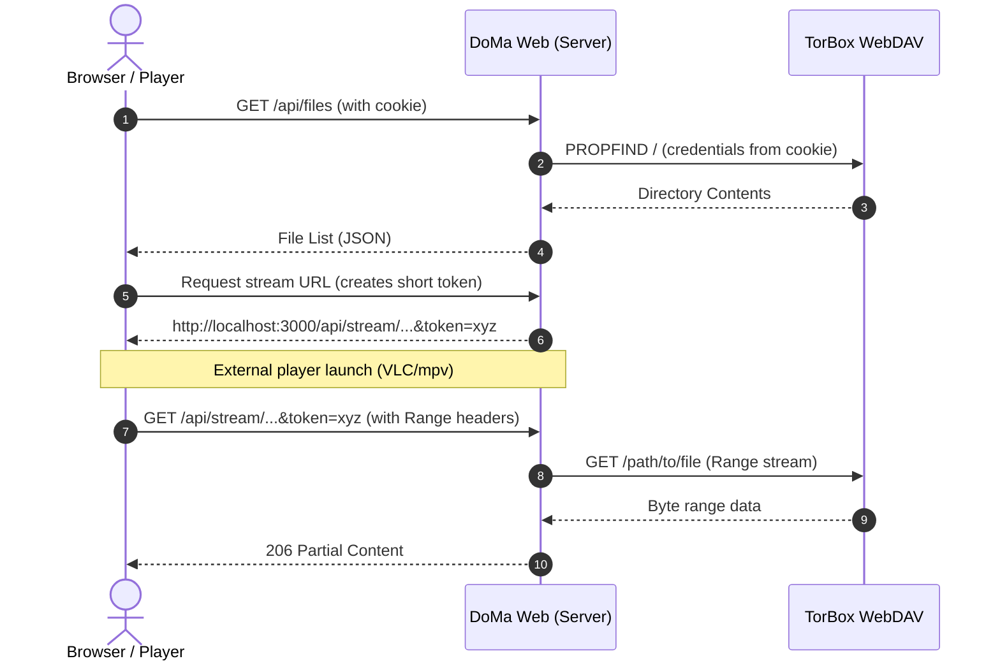

# DoMa Web

A lightweight, self-hosted web interface to browse, stream, and download files from your [TorBox](https://torbox.app) cloud storage via WebDAV.

[](https://bun.sh)
[](https://nextjs.org)
[](https://tailwindcss.com)
[](https://www.docker.com)
[](LICENSE)

---

## Overview

DoMa Web bridges your TorBox storage with your local environment. It runs as a lightweight, secure service that acts as an authenticated proxy. By translating WebDAV streams into tokenized HTTP endpoints, it allows you to play files directly in your native media players without exposing your credentials or setting up complex mounting utilities.

### Design Decisions

* **Stateless Authentication**: Session credentials are encrypted using AES-GCM and stored in a secure cookie via iron-session. The server remains stateless and does not require a database.
* **Direct Streaming**: Employs range request proxying to allow native players like VLC, mpv, or IINA to request byte ranges, enabling smooth seeking and low latency.
* **Security First**: Credentials never leave your self-hosted instance, and streaming links are protected by short-lived, single-use tokens.

---

## Quick Start

### Prerequisites

* Bun runtime (v1.0 or higher) or Node.js (v18.0 or higher)
* A TorBox account with WebDAV credentials enabled

### Local Setup

Clone the repository and install the dependencies:

```bash
git clone <repo-url> doma-web
cd doma-web
bun install
```

Configure your environment variables:

```bash
cp .env.example .env.local
```

Open `.env.local` and set `SESSION_SECRET` (must be at least 32 characters). You can generate a secure secret with:

```bash
openssl rand -base64 32
```

Launch the development server:

```bash
bun run dev
```

The application will be accessible at [http://localhost:3000](http://localhost:3000).

### Production Deployment

Build the optimized production bundles and start the server:

```bash
bun run build
bun run start
```

### Directly running via docker


```bash
docker pull sh7bham/webdoma:latest
docker run -p 3000:3000 -e SESSION_SECRET="your-secret-here" sh7bham/webdoma
```

---

## Configuration

The application is configured using environment variables. These can be set in a `.env.local` file or passed directly to the container runtime.

| Variable          | Required | Default                     | Description                                                        |
| :---------------- | :------: | :-------------------------- | :----------------------------------------------------------------- |
| `SESSION_SECRET`  |   Yes    | -                           | Secret key used to encrypt session cookies (minimum 32 characters) |
| `WEBDAV_BASE_URL` |    No    | `https://webdav.torbox.app` | Base URL of the TorBox WebDAV server                               |
| `PORT`            |    No    | `3000`                      | Port number the application server binds to                        |

---

## Media Player Integration

DoMa Web can launch desktop media players directly from the browser using custom protocol schemas or server-side execution.

| Player        | macOS | Windows | Linux | Method                            |
| :------------ | :---: | :-----: | :---: | :-------------------------------- |
| **mpv**       |  Yes  |   Yes   |  Yes  | Server-side execution             |
| **VLC**       |  Yes  |   Yes   |  Yes  | Server-side execution             |
| **IINA**      |  Yes  |    -    |   -   | Server-side execution             |
| **PotPlayer** |   -   |   Yes   |   -   | Protocol handler (`potplayer://`) |
| **Infuse**    |  Yes  |    -    |   -   | Protocol handler (`infuse://`)    |
| **Custom**    |  Yes  |   Yes   |  Yes  | Configurable URL templates        |

---

## Architecture Flow

The following sequence details how DoMa Web serves secure streams to external players:



---

## License

This project is licensed under the MIT License. See [LICENSE](LICENSE) for details.
